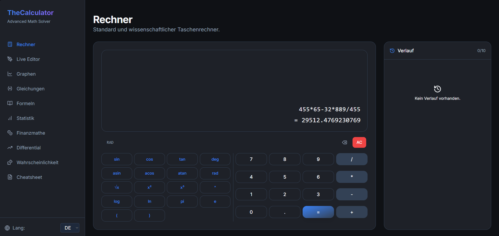
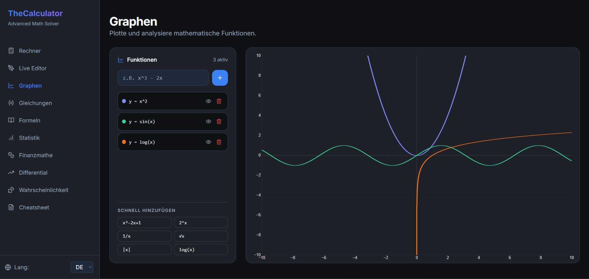
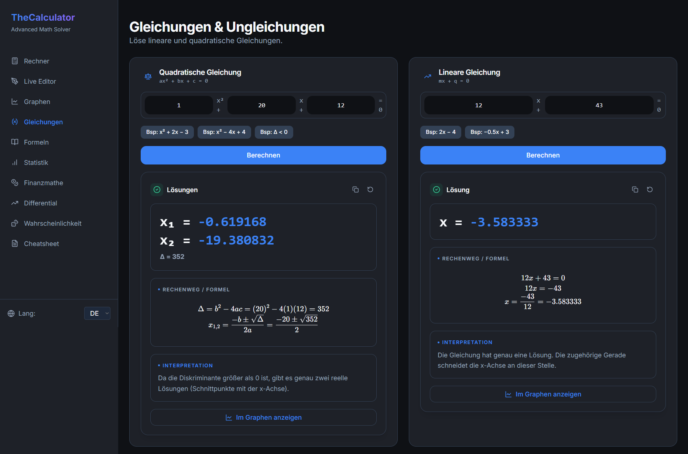
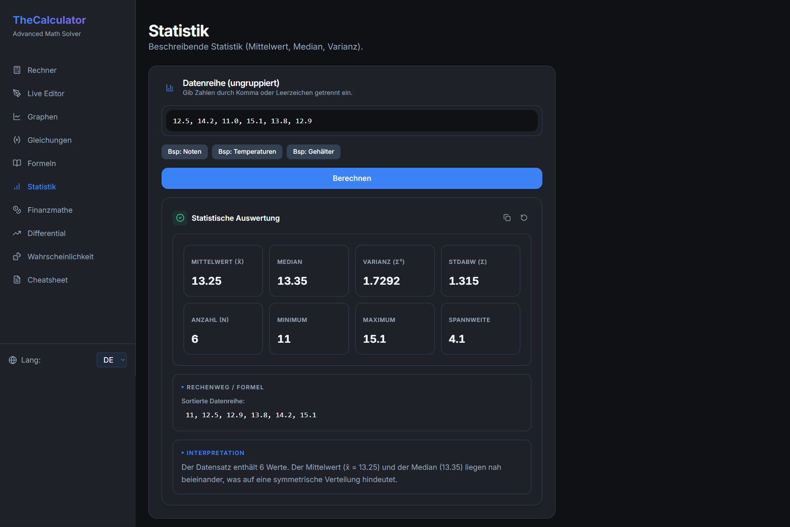

# SolveLab

SolveLab is a web-based math workspace built for students.  
It combines a scientific calculator, graphing tools, equation solving, statistics, finance tools, and a formula reference in one place.

## Features

- Scientific calculator
- Live math editor
- Function graphing
- Linear and quadratic equation solving
- Statistics tools
- Finance tools
- Differential calculus tools
- Probability and combinatorics tools
- Built-in cheatsheet / formula reference

## Screenshots

### Rechner

### Graphen

### Gleichungen

### Statistik

## Tech Stack

- Next.js
- React
- TypeScript
- Tailwind CSS

## Installation

Clone the repository:

    git clone https://github.com/Artur001/SolveLab.git
    cd SolveLab

Install dependencies:

    npm install --legacy-peer-deps

Start the development server:

    npm run dev

Then open:

    http://localhost:3000

## Project Structure

    src/
      app/         pages and routes
      components/  reusable UI components
      data/        formulas and datasets
      lib/         helpers and logic

    public/
      screenshots/ project screenshots

## Live Demo

[Live Demo Link](https://solve-lab.vercel.app)

## License

MIT
